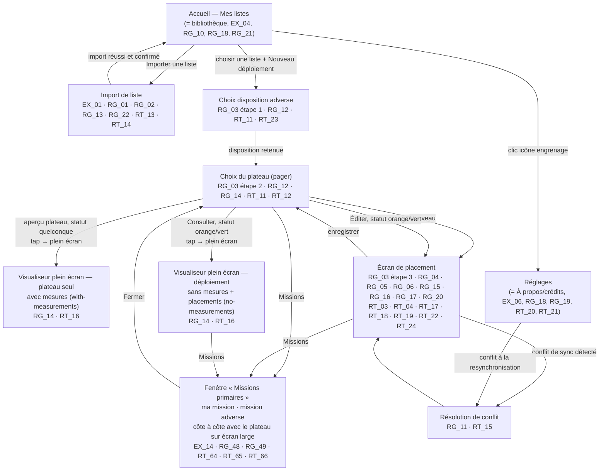

# Site map — Windfall Planner

> Dérivé de [spec.md](spec.md) et de l'inventaire de frames Figma de [design-figma.md](design-figma.md). Aucun de ces écrans n'est implémenté à ce jour (voir « Current state » dans [CLAUDE.md](../CLAUDE.md)) : ce document sert de plan de navigation cible, pas d'inventaire de l'existant.
>
> **Refonte du 2026-09-10** : la version précédente de ce document a été entièrement refaite suite aux arbitrages du product owner sur les écarts entre spec.md et la maquette (voir [design-figma.md](design-figma.md), section D) — en particulier la fusion de l'accueil et de la bibliothèque (écran 1), la fusion des Réglages et de la page À propos (écran 9), et l'intégration de l'assignation manuelle de socle dans l'écran d'import (écran 2). Chaque écran référence les `EX_XX`/`RG_XX`/`RT_XX` qui le contraignent, pour que l'implémentation future s'y raccroche directement.

## Vue d'ensemble

## Écrans

### 1. Accueil — Mes listes (= bibliothèque)
Point d'entrée unique et page bibliothèque à la fois : liste des listes d'armée importées, chacune donnant un accès direct à ses propres déploiements sauvegardés (ouverture pour édition, consultation en lecture seule, suppression confirmée). Un menu contextuel par liste permet de la supprimer (en cascade sur ses déploiements) ou de la dupliquer. Une icône engrenage, visible en permanence sur cet écran, donne accès à l'écran Réglages.
Traçabilité : [[EX_04]], [[RG_01]], [[RG_07]], [[RG_08]], [[RG_10]], [[RG_18]], [[RG_21]], [[RT_06]], [[RT_07]].

### 2. Import de liste
Formulaire d'import (roster JSON BattleScribe/NewRecruit ou autre format supporté) : bloqué hors-ligne avant toute tentative de parsing, avec message explicite invitant à réessayer une fois reconnecté. Une fois le fichier interprété, affiche sur ce même écran un récapitulatif (nombre d'unités/modèles/socles, nom de liste pré-rempli et éditable) ; toute unité non résolue par le référentiel de socles y est signalée et assignée manuellement par le joueur (pas d'écran séparé). La liste n'est enregistrée qu'après validation explicite du récapitulatif. Les listes déjà importées restent accessibles depuis l'accueil sans restriction hors-ligne.
Traçabilité : [[EX_01]], [[RG_01]], [[RG_02]], [[RG_13]], [[RG_22]], [[RT_01]], [[RT_02]], [[RT_13]], [[RT_14]].

### 3. Choix de la disposition adverse (parcours étape 1)
Sélection de la disposition adverse parmi les 5 proposées (référentiel statique id/libellé/icône), une fois la liste choisie — la disposition du joueur est déjà connue depuis l'import. Chaque bouton de disposition porte un code couleur agrégé (blanc/jaune/orange/vert) reflétant l'état des 3 déploiements associés à cette disposition.
Traçabilité : [[RG_03]] (étape 1), [[RG_12]], [[RT_11]], [[RT_23]].

### 4. Choix du plateau (parcours étape 2)
Les 3 plateaux associés au couple (disposition du joueur, disposition adverse) sont présentés un par un dans un pager glissable horizontalement. Un unique bloc « Statut » et un unique jeu d'actions contextuelles (Nouveau / Éditer / Consulter), affichés en haut à droite du layout à droite du libellé « Statut », reflètent le statut individuel (rouge/orange/vert) du seul plateau actuellement affiché par le pager. L'aperçu du plateau est cliquable (tap) vers le visualiseur plein écran, quel que soit son statut. Le bandeau des deux dispositions porte le bouton « Missions », qui ouvre la fenêtre des missions primaires du couple (voir « Fenêtre des missions primaires » ci-dessous).
Traçabilité : [[RG_03]] (étape 2), [[RG_12]], [[RG_14]], [[RT_11]], [[RT_12]], [[RG_48]].

### 5. Visualiseur plein écran — plateau seul (with-measurements)
Ouvert par un tap sur l'aperçu du plateau depuis l'écran 4, quel que soit son statut. Vue plateau vierge avec repères de mesure, pinch-to-zoom, avec une croix en haut à gauche pour sortir de ce mode ; ne montre jamais les placements du joueur.
Traçabilité : [[RG_14]], [[RT_16]], [[RT_12]].

### 6. Écran de placement (parcours étape 3)
Éditeur interactif : plateau SVG affiché au plus grand format possible à un zoom fixe non pilotable par le joueur, tokens de socles dimensionnés/colorés par unité, placés modèle par modèle par drag-and-drop tactile et rotables individuellement. Un bandeau ancré en bas de l'écran permet de sélectionner l'unité en cours et ses modèles restants ; un menu burger en haut à droite ouvre un panneau latéral (glissant depuis la droite, plateau partiellement visible) listant toutes les unités regroupées par forme/taille de socle avec leur statut de placement. Aucune zone de déploiement n'est matérialisée ni validée automatiquement — le placement reste libre sur l'ensemble du plateau affiché. L'en-tête porte, à gauche du bouton du plan de jeu, le bouton des missions primaires du couple.
Traçabilité : [[RG_48]], [[RG_03]] (étape 3), [[RG_04]], [[RG_05]], [[RG_06]], [[RG_15]], [[RG_16]], [[RG_17]], [[RG_20]], [[RT_03]], [[RT_04]], [[RT_17]], [[RT_18]], [[RT_19]], [[RT_22]], [[RT_24]].

### 7. Visualiseur plein écran — déploiement (no-measurements + placements)
Ouvert par un tap depuis l'action « Consulter » de l'écran 4 (statut orange/vert), ou depuis une entrée de la bibliothèque intégrée à l'accueil (écran 1). Vue plateau (variante sans mesures) avec les placements existants superposés en lecture seule, pinch-to-zoom, croix en haut à gauche pour sortir. En haut à droite, le bouton des missions primaires du couple, à gauche de celui du plan de jeu.
Traçabilité : [[RG_14]], [[RT_16]], [[RG_48]].

### Fenêtre des missions primaires (modale, pas un écran)
Fenêtre plein écran ouverte depuis les écrans 4, 6 et 7, qu'elle recouvre sans les quitter : la fermer ramène à l'écran d'origine dans l'état où le joueur l'avait laissé. Elle présente la carte de mission primaire du joueur et celle de l'adversaire pour le couple de dispositions en cours (une seule carte pour un couple miroir), chacune sur la couleur de sa disposition. Sur un écran étroit, les deux cartes sont dans deux onglets « Ma mission » / « Mission adverse » ; sur un écran d'au moins 720 px de large (tablette, téléphone en paysage), le plateau avec mesures, la mission du joueur et la mission adverse sont affichés côte à côte, chacun zoomable. Ce n'est pas une route : comme la fenêtre « Plan de jeu », elle ne figure pas dans la numérotation des écrans.
Traçabilité : [[EX_14]], [[RG_48]], [[RG_49]], [[RT_64]], [[RT_65]], [[RT_66]].

### 8. Résolution de conflit de synchronisation
Écran/modale présentant les deux versions (locale et serveur, horodatées) d'un déploiement modifié sur deux appareils avant resync ; le choix du joueur écrase l'autre version. Les enregistrements non conflictuels continuent de se synchroniser sans attendre cet écran.
Traçabilité : [[RG_11]], [[RT_15]].

### 9. Réglages (= À propos / Crédits)
Écran unique accessible depuis l'accueil via l'icône engrenage (visible même sans compte), regroupant trois blocs : Compte (création de compte / connexion si non connecté, sinon informations de compte + déconnexion), Informations utilisateur (email, état de synchronisation), et Mentions des sources tierces (attribution Wahapedia et Battlemaster, générée depuis les référentiels embarqués). Il n'existe pas d'écran « À propos » séparé : les mentions tierces sont le 3ᵉ bloc de cet écran.
Traçabilité : [[EX_06]], [[RG_10]], [[RG_18]], [[RG_19]], [[RT_09]], [[RT_10]], [[RT_20]], [[RT_21]].

## Notes de couverture

- Aucun écran de paramètres réseau/synchronisation détaillé n'est spécifié au-delà de l'indicateur "non synchronisé" non bloquant de [[RG_09]] — à préciser si un écran dédié est souhaité.
- [[RT_16]] (techno du composant plein écran pan/zoom) reste une décision non tranchée ; elle n'affecte pas ce site map (les écrans 5 et 7 partagent ce composant quel que soit le choix technique).
- Conformément à l'arbitrage du PO (voir [design-figma.md](design-figma.md), section C), ce site map — comme la maquette Figma — décrit la structure et la navigation cible, pas un rendu visuel final ; l'habillage CSS est un sujet distinct traité ultérieurement.
