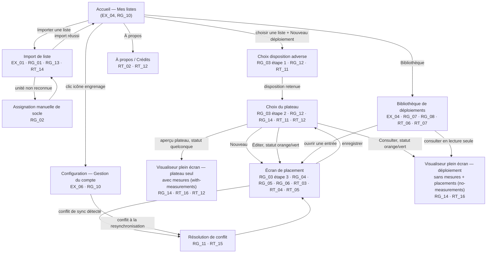

# Site map — 40K Deployment Planner

> Dérivé de [spec.md](spec.md). Aucun de ces écrans n'est implémenté à ce jour (voir « Current state » dans [CLAUDE.md](../CLAUDE.md)) : ce document sert de plan de navigation cible, pas d'inventaire de l'existant. Chaque écran référence les `EX_XX`/`RG_XX`/`RT_XX` qui le contraignent, pour que l'implémentation future s'y raccroche directement.

## Vue d'ensemble

## Écrans

### 1. Accueil — Mes listes
Point d'entrée : liste des listes d'armée importées, accès aux actions principales (importer, ouvrir une liste pour démarrer/reprendre un déploiement, bibliothèque, à propos). Une icône engrenage, visible en permanence sur cet écran, donne accès à l'écran de configuration (gestion du compte).
Traçabilité : [[RG_10]] (l'app est utilisable sans compte dès cet écran).

### 2. Import de liste
Formulaire d'import (roster JSON BattleScribe/NewRecruit ou autre format supporté). Bloqué hors-ligne avant toute tentative de parsing, avec message explicite invitant à réessayer une fois reconnecté ; les listes déjà importées restent accessibles depuis l'accueil sans restriction.
Traçabilité : [[EX_01]], [[RG_01]], [[RG_13]], [[RT_01]], [[RT_13]], [[RT_14]].

### 3. Assignation manuelle de socle
Écran/panneau contextuel affiché quand une unité importée n'est pas résolue par le référentiel [[RT_02]] : le joueur lui assigne manuellement une forme/diamètre de socle avant de pouvoir la déployer.
Traçabilité : [[RG_02]].

### 4. Choix de la disposition adverse (parcours étape 1)
Sélection de la disposition adverse parmi les 5 proposées, une fois la liste choisie (la disposition du joueur est déjà connue depuis l'import). Chaque bouton de disposition porte un code couleur agrégé (blanc/jaune/orange/vert) reflétant l'état des 3 déploiements associés à cette disposition.
Traçabilité : [[RG_03]] (étape 1), [[RG_12]], [[RT_11]].

### 5. Choix du plateau (parcours étape 2)
Les 3 plateaux associés au couple (disposition du joueur, disposition adverse) sont présentés avec un statut individuel (rouge/orange/vert), un aperçu cliquable en plein écran, et jusqu'à trois actions contextuelles (Nouveau / Éditer / Consulter) selon ce statut.
Traçabilité : [[RG_03]] (étape 2), [[RG_12]], [[RG_14]], [[RT_11]], [[RT_12]].

### 6. Visualiseur plein écran — plateau seul (with-measurements)
Vue plateau vierge avec repères de mesure, zoomable/pannable, accessible depuis n'importe quel statut à l'étape 2 ; ne montre jamais les placements du joueur.
Traçabilité : [[RG_14]], [[RT_16]], [[RT_12]].

### 7. Écran de placement (parcours étape 3)
Éditeur interactif : plateau SVG, tokens de socles dimensionnés/colorés par unité, placés modèle par modèle (drag-and-drop tactile), zone de déploiement contrôlée, liste latérale des unités "en attente de déploiement".
Traçabilité : [[RG_03]] (étape 3), [[RG_04]], [[RG_05]], [[RG_06]], [[RT_03]], [[RT_04]], [[RT_05]].

### 8. Visualiseur plein écran — déploiement (no-measurements + placements)
Vue plateau (variante sans mesures) avec les placements existants superposés en lecture seule, zoomable/pannable ; accessible via l'action « Consulter » à l'étape 2 ou depuis la bibliothèque.
Traçabilité : [[RG_14]], [[RT_16]].

### 9. Bibliothèque de déploiements
Liste des déploiements sauvegardés, liés à leur liste d'armée d'origine ; ouverture pour édition (→ écran de placement), consultation en lecture seule (→ visualiseur), suppression confirmée explicitement (sans supprimer la liste associée).
Traçabilité : [[EX_04]], [[RG_07]], [[RG_08]], [[RT_06]], [[RT_07]].

### 10. Configuration — Gestion du compte
Écran accessible depuis l'accueil via l'icône engrenage (visible même sans compte), regroupant la gestion du compte : création de compte / connexion — déclenchée uniquement quand le joueur souhaite synchroniser vers un second appareil —, consultation de l'état de synchronisation, et déconnexion. L'app reste pleinement fonctionnelle sans y accéder tant qu'aucune synchronisation multi-appareils n'est souhaitée.
Traçabilité : [[EX_06]], [[RG_10]], [[RT_09]], [[RT_10]].

### 11. Résolution de conflit de synchronisation
Écran/modale présentant les deux versions (locale et serveur, horodatées) d'un déploiement modifié sur deux appareils avant resync ; le choix du joueur écrase l'autre version. Les enregistrements non conflictuels continuent de se synchroniser sans attendre cet écran.
Traçabilité : [[RG_11]], [[RT_15]].

### 12. À propos / Crédits
Écran obligatoire pour l'attribution des données référentielles générées hors-ligne : « Powered by Wahapedia » (socles) et Battlemaster/battlemaster.online (plateaux).
Traçabilité : [[RT_02]], [[RT_12]].

## Notes de couverture

- Aucun écran de paramètres réseau/synchronisation détaillé n'est spécifié au-delà de l'indicateur "non synchronisé" non bloquant de [[RG_09]] — à préciser si un écran dédié est souhaité.
- [[RT_16]] (techno du composant plein écran pan/zoom) reste une décision non tranchée ; elle n'affecte pas ce site map (les écrans 6 et 8 partagent ce composant quel que soit le choix technique).
